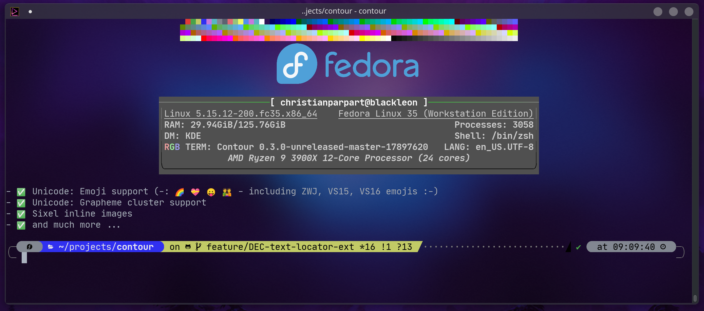

# Contour - A modern C++ Terminal Emulator
[](https://github.com/contour-terminal/contour/actions?query=workflow%3ABuild)
[](https://codecov.io/gh/contour-terminal/contour)
[](https://isocpp.org/)
[](https://discord.gg/ncv4pG9)
[](https://twitch.tv/christianparpart)




**IMPORTANT: THIS PROJECT IS IN BETA STAGE & ACTIVE DEVELOPMENT**

`contour` is a modern terminal emulator, for everyday use. It is aiming
for power users with a modern feature mindset.

## Features

- ✅ Available on all 3 major platforms, Linux, OS/X, Windows (Windows is alpha stage).
- ✅ GPU-accelerated rendering.
- ✅ Font ligatures support (such as in Fira Code).
- ✅ Unicode: Emoji support (-: 🌈 💝 😛 👪 - including ZWJ, VS15, VS16 emoji :-)
- ✅ Unicode: Grapheme cluster support
- ✅ Bold and italic fonts
- ✅ High-DPI support.
- ✅ Vertical Line Markers (quickly jump to markers in your history!)
- ✅ Blurred behind transparent background when using Windows 10 or KDE window manager on Linux.
- ✅ Runtime configuration reload
- ✅ 256-color and Truecolor support
- ✅ Key binding customization
- ✅ Color Schemes
- ✅ Profiles (grouped customization of: color scheme, login shell, and related behaviours)
- ✅ [Synchronized rendering](https://github.com/contour-terminal/contour/wiki/VTExtensions#synchronized-output) (via `SM ? 2026` / `RM ? 2026`)
- ✅ Text reflow (configurable via `SM ? 2027` / `RM ? 2027`)
- ✅ Clickable hyperlinks via [OSC 8](https://gist.github.com/egmontkob/eb114294efbcd5adb1944c9f3cb5feda)
- ✅ Clipboard setting via OSC 52
- ✅ Sixel inline images
- ✅ Terminal page [buffer capture VT extension](https://github.com/contour-terminal/contour/wiki/VTExtensions#buffer-capture) to quickly extract contents.
- ✅ and much more ...

## Requirements

- **operating system**: A *recent* operating system (OS/X 12, Windows 10+, an up-to-date Linux, or FreeBSD)
- **GPU**: driver must support at least OpenGL 3.3 hardware accelerated or as software rasterizer.
- **CPU**: x86-64 AMD or Intel with AES-NI instruction set.

## CLI - Command Line Interface

```txt
  Usage:

    contour [terminal] [config FILE] [profile NAME] [debug TAGS] [live-config]
                       [dump-state-at-exit PATH] [early-exit-threshold UINT]
                       [working-directory DIRECTORY] [class WM_CLASS]
                       [platform PLATFORM[:OPTIONS]] [session SESSION_ID] [PROGRAM ARGS...]
    contour font-locator [config FILE] [profile NAME] [debug TAGS]
    contour help
    contour version
    contour license
    contour parser-table
    contour list-debug-tags
    contour generate terminfo to FILE
    contour generate config to FILE
    contour generate integration shell SHELL to FILE
    contour capture [logical] [timeout SECONDS] [lines COUNT] to FILE
    contour set profile [to NAME]

```

## Installing from source

It's best installed from supported package managers, but if you want
to build from source, it is recommended to execute the `scripts/install-deps.sh` script.

### Prerequisites UNIX-like systems (Linux, FreeBSD, OS/X)

```sh
./scripts/install-deps.sh
```

### Prerequisites Windows 10 or newer

For Windows, you must have Windows 10, 2018 Fall Creators Update, and Visual Studio 2019, installed.
It will neither build nor run on any prior Windows OS, due to libterminal making use of [ConPTY API](https://devblogs.microsoft.com/commandline/windows-command-line-introducing-the-windows-pseudo-console-conpty/).

```psh
.\scripts\install-deps.ps1
```

### Compile

```sh
mkdir build
cmake -S . -B build
cmake --build build/

# Optionally, if you want to install from source
cmake --build build/ --target install
```

# References

* [VT510](https://vt100.net/docs/vt510-rm/): VT510 Manual, see Chapter 5.
* [ECMA-35](http://www.ecma-international.org/publications/standards/Ecma-035.htm):
    Character Code Structure and Extension Techniques
* [ECMA-43](http://www.ecma-international.org/publications/standards/Ecma-043.htm):
    8-bit Coded Character Set Structure and Rules
* [ECMA-48](http://www.ecma-international.org/publications/standards/Ecma-048.htm):
    Control Functions for Coded Character Sets
* [ISO/IEC 8613-6](https://www.iso.org/standard/22943.html):
    Character content architectures
* [xterm](https://invisible-island.net/xterm/ctlseqs/ctlseqs.html): xterm control sequences
* [console\_codes](http://man.he.net/man4/console_codes) Linux console codes
* [Summary of ANSI standards for ASCII terminals](http://www.inwap.com/pdp10/ansicode.txt)
* [Text Terminal HOWTO (Chapter 7.2, PTY)](http://tldp.org/HOWTO/Text-Terminal-HOWTO-7.html#ss7.2)
* [ANSI escape code](https://en.wikipedia.org/wiki/ANSI_escape_code) in Wikipedia

### License

```
Contour - A modern C++ Terminal Emulator
-------------------------------------------

Licensed under the Apache License, Version 2.0 (the "License");
you may not use this file except in compliance with the License.

Unless required by applicable law or agreed to in writing, software
distributed under the License is distributed on an "AS IS" BASIS,
WITHOUT WARRANTIES OR CONDITIONS OF ANY KIND, either express or implied.
See the License for the specific language governing permissions and
limitations under the License.
```
