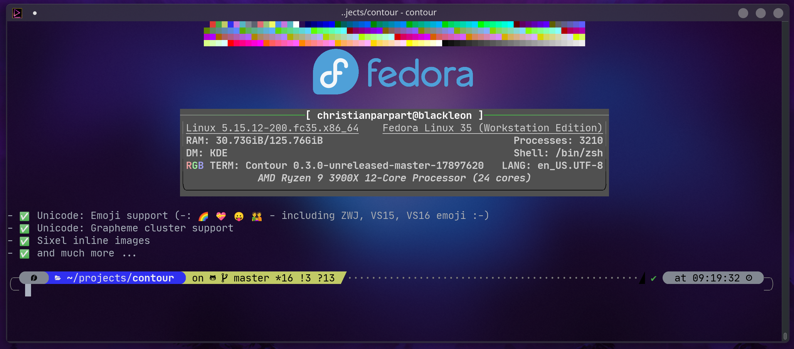

# Contour - a modern & actually fast Terminal Emulator
[](https://github.com/contour-terminal/contour/actions/workflows/build.yml)
[](https://codecov.io/gh/contour-terminal/contour)
[](https://isocpp.org/)
[](https://discord.gg/ncv4pG9)
[](https://twitch.tv/christianparpart)




`contour` is a modern and actually fast, modal, virtual terminal emulator,
for everyday use. It is aiming for power users with a modern feature mindset.

## Features

- ✅ Available on all major platforms, Linux, macOS, FreeBSD, OpenBSD, Windows.
- ✅ GPU-accelerated rendering.
- ✅ Font ligatures support (such as in Fira Code).
- ✅ Unicode: Emoji support (-: 🌈 💝 😛 👪 - including ZWJ, VS15, VS16 emoji :-)
- ✅ Unicode: Grapheme cluster support
- ✅ Terminal tabs
- ✅ [Persistent sessions](https://contour-terminal.org/persistent-sessions/) that survive the window (daemon mode) — reattach locally or over the network, and interoperate with tmux in both directions
- ✅ Bold and italic fonts
- ✅ High-DPI support.
- ✅ Vertical Line Markers (quickly jump to markers in your history!)
- ✅ Vi-like input modes for improved selection and copy'n'paste experience and Vi-like `scrolloff` feature.
- ✅ Blurred behind transparent background support for Windows 10 and above as well as the KDE and GNOME desktop environment on Linux.
- ✅ Blurrable Background image support.
- ✅ Runtime configuration reload
- ✅ 256-color and Truecolor support
- ✅ Key binding customization
- ✅ Color Schemes
- ✅ Profiles (grouped customization of: color scheme, login shell, and related behaviors)
- ✅ [Synchronized rendering](https://contour-terminal.org/vt-extensions/synchronized-output/) (via `SM ? 2026` / `RM ? 2026`)
- ✅ Text reflow (configurable via `SM ? 2028` / `RM ? 2028`)
- ✅ Clickable hyperlinks via [OSC 8](https://gist.github.com/egmontkob/eb114294efbcd5adb1944c9f3cb5feda)
- ✅ Clipboard setting via OSC 52
- ✅ Sixel inline images
- ✅ ReGIS vector graphics (VT330/VT340)
- ✅ Terminal page [buffer capture VT extension](https://contour-terminal.org/vt-extensions/buffer-capture/) to quickly extract contents.
- ✅ Builtin [Fira Code inspired progress bar](https://github.com/contour-terminal/contour/issues/521) support.
- ✅ Read-only mode, protecting against accidental user-input to the running application, such as <kbd>Ctrl</kbd>+<kbd>C</kbd>.
- ✅ VT320 Host-programmable and Indicator status line support.
- ✅ and much more ...

## Installation

`contour` is packaged and available for installation on multiple distributions:
 - `Fedora` use official [package](https://packages.fedoraproject.org/pkgs/contour-terminal/contour-terminal/)
 - `Arch` use official [package](https://archlinux.org/packages/extra/x86_64/contour/)
 - `Void` use official [package](https://github.com/void-linux/void-packages/tree/master/srcpkgs/contour)
 - `openSUSE` use official [package](https://build.opensuse.org/package/show/X11:terminals/contour-terminal)

Additional packages can be found on the release [page](https://github.com/contour-terminal/contour/releases) including:
 - ubuntu package
 - AppImage
 - static build
 - MacOS bundle
 - Windows installer and zipped app


### Installing via Flatpak

#### Install from Flathub

Click the following button to install Contour from the Flathub store.

[](https://flathub.org/apps/details/org.contourterminal.Contour)


#### Prerequisites

- Make sure you have flatpak installed in your system ([here is a tutorial on how to install it](https://flatpak.org/getting.html)), and make sure that the version is >= 0.10 (check it using this command: `flatpak --version`)
- Add the [flathub](https://flathub.org) repository using the following command: `flatpak remote-add --if-not-exists flathub https://dl.flathub.org/repo/flathub.flatpakrepo`.
- Proceed with one of the following options:
  - [Install from Flathub](#install-from-flathub)
  - [Install from GitHub release](https://github.com/contour-terminal/contour/releases)

## Requirements

- **operating system**: A *recent* operating system (macOS, Windows 10+, an up-to-date Linux, FreeBSD or OpenBSD)
- **GPU**: driver must support at least OpenGL 3.3 hardware accelerated or as software rasterizer.
- **CPU**: x86-64 AMD or Intel with AES-NI instruction set or ARMv8 with crypto extensions.

## Configuration

In order to configure Contour, it is necessary to modify the configuration file
`contour.yml`, which is initially generated in the `$HOME/.config/contour`
directory. Some features also require shell integration. These can be generated
via the CLI (see below), these currently exist for zsh, fish and tcsh.

## Persistent sessions (daemon mode)

> **Experimental.** Daemon mode is new in 0.7.0 and still settling. It is built into every Contour
> and covered by the test suite, but its command-line flags and its wire protocol may change
> between releases.

Contour already gives you tabs and split panes inside one window. Daemon mode goes further: it
moves your sessions into a background process, so they survive the window that shows them. A long
build keeps going after you close the window, work done over SSH survives the link dropping, and
the same sessions can be reattached from another machine over an encrypted connection.

```sh
contour client   # attaches to the daemon, starting one if none is running
```

Contour also speaks tmux's control-mode protocol in both directions: tmux-aware tooling — and the
stock `tmux` binary itself — can attach to a Contour daemon, and `contour client --tmux` mirrors a
running tmux server into a Contour window, windows as tabs and panes as splits.

See [Persistent sessions](https://contour-terminal.org/persistent-sessions/) for the full guide.

## Installing from source

Contour is best installed from supported package managers, but you can build
from source by following the instructions below.

### UNIX-like systems (Linux, FreeBSD, OpenBSD, macOS)

#### Prerequisites

```sh
./scripts/install-deps.sh
```

This script *might* ask you for the administrator password if a package dependency
can be installed via the system package manager.

#### Compile

You can use cmake presets to compile contour. The full list of available presets can be seen using `cmake --list-presets`. To compile release build for linux `clang-release` or `gcc-release`, or `appleclang-release` on macOS accordingly.

```sh
cmake --preset clang-release
cmake --build --preset clang-release

# Optionally, if you want to install from source
cmake --build --preset clang-release --target install
```

#### Windows 10 or newer

#### Prerequisites

For Windows, you must have Windows 10, 2018 Fall Creators Update, and Visual Studio 2019, installed.
It will neither build nor run on any prior Windows OS, due to libterminal making use of [ConPTY API](https://devblogs.microsoft.com/commandline/windows-command-line-introducing-the-windows-pseudo-console-conpty/).

### Using External ConPTY Support on Windows 10

On Windows 10, the built-in ConPTY implementation has limitations with mouse input handling, particularly when using WSL2 with terminal applications like tmux. This is a known issue that affects several terminal emulators.

Contour supports using an external `conpty.dll` implementation which resolves these issues on Windows 10.

To enable external ConPTY:

1. Get `conpty.dll` and `OpenConsole.exe` files from wezterm:
   Go to https://github.com/wez/wezterm/tree/main/assets/windows/conhost and download `conpty.dll` and `OpenConsole.exe`
2. Put these files into your Contour bin directory (e.g. C:\Program Files\Contour Terminal Emulator 0.6\bin\)
3. Start Contour. It will automatically detect and use the external ConPTY implementation.

1. Set up [vcpkg](https://vcpkg.io/en/getting-started.html), preferably somewhere high up in the folder hierarchy, and add the folder to your `PATH`.

```
cd C:\
git clone https://github.com/Microsoft/vcpkg.git
.\vcpkg\bootstrap-vcpkg.bat
```

2. Install Visual Studio Build Tools (make sure to select the CLI tools for
   C++, which you might need to do in the separate components tab).
3. Install Qt6 (i.e. to C:\Qt)
4. Open the _developer_ version of Powershell.
5. In the `contour` source folder execute `.\scripts\install-deps.ps1`. This step may take a _very_ long time.


#### Compile

In the _developer_ version of Powershell:

```psh
# change paths accordingly if you installed QT and vcpkg to somewhere else
cmake -S . -B build -DCMAKE_TOOLCHAIN_FILE=C:\vcpkg\scripts\buildsystems\vcpkg.cmake -DCMAKE_PREFIX_PATH=C:\Qt\6.5.0\msvc2019_64\lib\cmake
cmake --build build/

# Optionally, if you want to install from source
cmake --build build/ --target install
```

#### Distribution Packages

[](https://repology.org/project/contour-terminal/versions)

## CLI - Command Line Interface

```txt
  Usage:

    contour [terminal] [config FILE] [profile NAME] [debug TAGS] [live-config] [dump-state-at-exit PATH]
                       [early-exit-threshold UINT] [working-directory DIRECTORY] [class WM_CLASS]
                       [platform PLATFORM[:OPTIONS]] [session SESSION_ID] [PROGRAM ARGS...]
    contour font-locator [config FILE] [profile NAME] [debug TAGS]
    contour info vt
    contour help
    contour version
    contour license
    contour parser-table
    contour list-debug-tags
    contour daemon [socket PATH] [label NAME] [exit-with-last-session] [tmux-compat-socket LABEL]
                   [listen-tcp HOST:PORT] [token TOKEN] [token-file FILE]
                   [tls-cert FILE] [tls-key FILE] [log TAGS] [log-file FILE]
    contour client [socket PATH] [label NAME] [tmux] [tmux-socket PATH] [profile NAME] [config FILE]
                   [connect-tcp HOST:PORT] [token TOKEN] [token-file FILE] [tls-ca FILE]
                   [log TAGS] [log-file FILE]
    contour generate terminfo to FILE
    contour generate config to FILE
    contour generate integration shell SHELL to FILE
    contour capture [logical] [words] [timeout SECONDS] [lines COUNT] to FILE
    contour set profile [to NAME]

```

# References

* [VT510](https://vt100.net/docs/vt510-rm/): VT510 Manual, see Chapter 5.
* [ECMA-35](http://www.ecma-international.org/publications-and-standards/standards/ecma-35):
    Character Code Structure and Extension Techniques
* [ECMA-43](http://www.ecma-international.org/publications-and-standards/standards/ecma-43):
    8-bit Coded Character Set Structure and Rules
* [ECMA-48](http://www.ecma-international.org/publications-and-standards/standards/ecma-48):
    Control Functions for Coded Character Sets
* [ISO/IEC 8613-6](https://www.iso.org/standard/22943.html):
    Character content architectures
* [xterm](https://invisible-island.net/xterm/ctlseqs/ctlseqs.html): xterm control sequences
* [console\_codes](http://man.he.net/man4/console_codes) Linux console codes
* [Summary of ANSI standards for ASCII terminals](http://www.inwap.com/pdp10/ansicode.txt)
* [Text Terminal HOWTO (Chapter 7.2, PTY)](http://tldp.org/HOWTO/Text-Terminal-HOWTO-7.html#ss7.2)
* [ANSI escape code](https://en.wikipedia.org/wiki/ANSI_escape_code) in Wikipedia

### License

```
Contour - A modern C++ Terminal Emulator
-------------------------------------------

Licensed under the Apache License, Version 2.0 (the "License");
you may not use this file except in compliance with the License.

Unless required by applicable law or agreed to in writing, software
distributed under the License is distributed on an "AS IS" BASIS,
WITHOUT WARRANTIES OR CONDITIONS OF ANY KIND, either express or implied.
See the License for the specific language governing permissions and
limitations under the License.
```


## 🌐 Web Resources & Aesthetic Symbols Index
- [SYM 1F9D0](https://sleek-mono-symbols-75.pages.dev/symbol/sym-1f9d0/)
- [JA](https://soft-pink-fonts-41.pages.dev/ja/)
- [STAR OPERATOR](https://clean-sparkle-text-75.pages.dev/symbol/star-operator/)
- [TIKTOK CAPTIONS](https://minimal-star-symbols-91.pages.dev/ja/tiktok-captions/)
- [SYM 1D47A](https://ribbon-bow-unicode-18.pages.dev/symbol/sym-1d47a/)
- [ZODIAC CELESTIAL](https://bows-and-lace-text-69.pages.dev/vi/zodiac-celestial/)
- [SYM 26D4](https://synth-dystopia-text-20.pages.dev/symbol/sym-26d4/)
- [SYM 26F1](https://soft-pink-fonts-41.pages.dev/symbol/sym-26f1/)
- [ARROWS LINES](https://pastel-moe-emoticons-55.pages.dev/pt/arrows-lines/)
- [LEFT MATHEMATICAL WHITE SQUARE BRACKET](https://matrix-terminal-fonts-30.pages.dev/symbol/left-mathematical-white-square-bracket/)
- [SYM 1D467](https://scholarly-script-hub-43.pages.dev/symbol/sym-1d467/)
- [SYM 1F600](https://angelic-bio-symbols-59.pages.dev/symbol/sym-1f600/)
- [SYM 2645](https://scholarly-script-hub-43.pages.dev/symbol/sym-2645/)
- [SYM 1D4A2](https://balletcore-unicode-67.pages.dev/symbol/sym-1d4a2/)
- [SYM 1F9D0](https://occult-rune-symbols-64.pages.dev/symbol/sym-1f9d0/)
- [SYM 1D481](https://zen-aesthetic-fonts-87.pages.dev/symbol/sym-1d481/)
- [SYM 1D426](https://scholarly-script-hub-43.pages.dev/symbol/sym-1d426/)
- [SYM 1F63C](https://anime-sparkle-text-14.pages.dev/symbol/sym-1f63c/)
- [HEAVY RIGHTWARD ARROW](https://cyber-clan-tags-38.pages.dev/symbol/heavy-rightward-arrow/)
- [PINWHEEL STAR](https://manga-speech-symbols-95.pages.dev/symbol/pinwheel-star/)
- [SYM 274B](https://dark-poetry-fonts-30.pages.dev/symbol/sym-274b/)
- [SYM 2679](https://cute-face-emoticons-66.pages.dev/symbol/sym-2679/)
- [SYM 1D469](https://fairy-lace-symbols-92.pages.dev/symbol/sym-1d469/)
- [SYM 1F614](https://balletcore-unicode-67.pages.dev/symbol/sym-1f614/)
- [SYM 1F970](https://pastel-manga-symbols-57.pages.dev/symbol/sym-1f970/)
- [INSTAGRAM BIO](https://zen-unicode-hub-94.pages.dev/ja/instagram-bio/)
- [KAOMOJI](https://zen-unicode-hub-94.pages.dev/es/kaomoji/)
- [SYM 2631](https://minimal-star-symbols-26.pages.dev/symbol/sym-2631/)
- [SYM 2741](https://anime-sparkle-text-45.pages.dev/symbol/sym-2741/)
- [SYM 1F628](https://gothic-bio-fonts-98.pages.dev/symbol/sym-1f628/)
- [LEFT WING CLAN FLARE](https://kawaii-kaomoji-hub-77.pages.dev/symbol/left-wing-clan-flare/)
- [SYM 1F496](https://zen-unicode-hub-94.pages.dev/symbol/sym-1f496/)
- [SYM 1D425](https://baroque-crown-unicode-60.pages.dev/symbol/sym-1d425/)
- [SYM 2687](https://arcane-symbol-vault-32.pages.dev/symbol/sym-2687/)
- [SYM 267D](https://scholar-rune-symbols-77.pages.dev/symbol/sym-267d/)
- [TIKTOK CAPTIONS](https://zen-unicode-hub-94.pages.dev/es/tiktok-captions/)
- [SYM 2636](https://minimal-star-symbols-43.pages.dev/symbol/sym-2636/)
- [SYM 1F628](https://synthwave-text-vault-95.pages.dev/symbol/sym-1f628/)
- [LEFT WHITE CORNER BRACKET](https://mecha-gamer-fonts-53.pages.dev/symbol/left-white-corner-bracket/)
- [CANCER ZODIAC CRAB](https://balletcore-unicode-67.pages.dev/symbol/cancer-zodiac-crab/)
- [SYM 1D423](https://minimal-star-symbols-54.pages.dev/symbol/sym-1d423/)
- [LIBRA ZODIAC SCALES](https://balletcore-unicode-67.pages.dev/symbol/libra-zodiac-scales/)
- [SYM 1F479](https://zen-unicode-hub-94.pages.dev/symbol/sym-1f479/)
- [SYM 2738](https://zen-unicode-hub-94.pages.dev/symbol/sym-2738/)
- [RIGHTWARDS PAIRED HARPOON](https://scholar-rune-symbols-77.pages.dev/symbol/rightwards-paired-harpoon/)
- [SYM 2629](https://mecha-gamer-fonts-53.pages.dev/symbol/sym-2629/)
- [FREEFIRE NAMES](https://sleek-bio-fonts-25.pages.dev/pt/freefire-names/)
- [FREEFIRE NAMES](https://zen-unicode-hub-94.pages.dev/pt/freefire-names/)
- [SYM 1F97A](https://neon-glitch-fonts-20.pages.dev/symbol/sym-1f97a/)
- [SYM 1D459](https://soft-pink-fonts-41.pages.dev/symbol/sym-1d459/)
- [SYM 2743](https://anime-sparkle-text-95.pages.dev/symbol/sym-2743/)
- [ROBLOX NAMES](https://synthwave-text-vault-95.pages.dev/pt/roblox-names/)
- [SYM 26CA](https://arcane-symbol-vault-32.pages.dev/symbol/sym-26ca/)
- [BRACKETS](https://anime-sparkle-text-81.pages.dev/ja/brackets/)
- [SYM 26E1](https://chibi-emoticon-world-87.pages.dev/symbol/sym-26e1/)
- [SYM 273D](https://minimal-star-symbols-32.pages.dev/symbol/sym-273d/)
- [STAR OPERATOR](https://baroque-crown-unicode-60.pages.dev/symbol/star-operator/)
- [SYM 26AA](https://angelic-bow-symbols-76.pages.dev/symbol/sym-26aa/)
- [INSTAGRAM BIO](https://chibi-emoticon-world-87.pages.dev/pt/instagram-bio/)
- [SYM 260B](https://baroque-crown-unicode-60.pages.dev/symbol/sym-260b/)
- [SYM 2663](https://minimal-star-symbols-43.pages.dev/symbol/sym-2663/)
- [SYM 26BE](https://minimal-star-symbols-91.pages.dev/symbol/sym-26be/)
- [CLOCKWISE OPEN CIRCLE ARROW](https://kawaii-kaomoji-hub-80.pages.dev/symbol/clockwise-open-circle-arrow/)
- [STARS](https://zen-unicode-hub-94.pages.dev/ru/stars/)
- [INSTAGRAM BIO](https://cute-face-emoticons-66.pages.dev/ru/instagram-bio/)
- [FREEFIRE NAMES](https://pearl-heart-symbols-95.pages.dev/pt/freefire-names/)
- [FLOWER GIRL SMILE KAOMOJI](https://gothic-bio-fonts-69.pages.dev/symbol/flower-girl-smile-kaomoji/)
- [SYM 1D463](https://sleek-arrow-symbols-42.pages.dev/symbol/sym-1d463/)
- [SYM 2725](https://clean-mono-fonts-64.pages.dev/symbol/sym-2725/)
- [SYM 1D405](https://alchemist-symbol-hub-29.pages.dev/symbol/sym-1d405/)
- [FREEFIRE NAMES](https://sleek-dot-symbols-31.pages.dev/ru/freefire-names/)
- [SYM 1D407](https://clean-line-emojis-93.pages.dev/symbol/sym-1d407/)
- [SYM 1D494](https://pastel-moe-emoticons-55.pages.dev/symbol/sym-1d494/)
- [SYM 1D467](https://zen-unicode-hub-94.pages.dev/symbol/sym-1d467/)
- [GAMING WEAPONS](https://matrix-terminal-fonts-30.pages.dev/gaming-weapons/)
- [SYM 2644](https://coquette-aesthetic-symbols-96.pages.dev/symbol/sym-2644/)
- [SYM 2734](https://anime-sparkle-text-45.pages.dev/symbol/sym-2734/)
- [SYM 1D491](https://zen-unicode-hub-94.pages.dev/symbol/sym-1d491/)
- [SYM 1D451](https://scholar-rune-symbols-77.pages.dev/symbol/sym-1d451/)
- [LEFT MATHEMATICAL WHITE SQUARE BRACKET](https://kawaii-kaomoji-hub-88.pages.dev/symbol/left-mathematical-white-square-bracket/)
- [SYM 1FA77](https://neon-glitch-fonts-20.pages.dev/symbol/sym-1fa77/)
- [SYM 1F637](https://kawaii-kaomoji-hub-88.pages.dev/symbol/sym-1f637/)
- [SYM 26FE](https://zen-unicode-hub-94.pages.dev/symbol/sym-26fe/)
- [SYM 1D424](https://anime-sparkle-text-95.pages.dev/symbol/sym-1d424/)
- [SYM 1D48C](https://arcane-symbol-vault-32.pages.dev/symbol/sym-1d48c/)
- [FLORAL BRANCH BOUQUET](https://balletcore-unicode-67.pages.dev/symbol/floral-branch-bouquet/)
- [SYM 268D](https://arcane-symbol-vault-32.pages.dev/symbol/sym-268d/)
- [SYM 1FAE3](https://chibi-emoticon-world-87.pages.dev/symbol/sym-1fae3/)
- [SYM 1F617](https://kawaii-kaomoji-hub-88.pages.dev/symbol/sym-1f617/)
- [SYM 26F4](https://pastel-manga-symbols-57.pages.dev/symbol/sym-26f4/)
- [SYM 2723](https://soft-pink-fonts-41.pages.dev/symbol/sym-2723/)
- [DAGGER BLADE](https://pearl-heart-symbols-95.pages.dev/symbol/dagger-blade/)
- [SYM 263A FE0F](https://anime-sparkle-text-73.pages.dev/symbol/sym-263a-fe0f/)
- [SYM 1FA75](https://zen-unicode-hub-94.pages.dev/symbol/sym-1fa75/)
- [SYM 1F916](https://zen-unicode-hub-94.pages.dev/symbol/sym-1f916/)
- [SYM 1F648](https://coquette-heart-text-40.pages.dev/symbol/sym-1f648/)
- [SYM 1F978](https://neon-glitch-fonts-20.pages.dev/symbol/sym-1f978/)
- [SYM 1F640](https://sleek-dot-symbols-31.pages.dev/symbol/sym-1f640/)
- [SYM 260B](https://anime-sparkle-text-95.pages.dev/symbol/sym-260b/)
- [SYM 2658](https://kawaii-kaomoji-hub-88.pages.dev/symbol/sym-2658/)
- [SYM 1F643](https://balletcore-unicode-67.pages.dev/symbol/sym-1f643/)
- [SYM 267A](https://vintage-scholar-text-15.pages.dev/symbol/sym-267a/)
- [DAGGER CROSS SYMBOL](https://mecha-gamer-fonts-53.pages.dev/symbol/dagger-cross-symbol/)
- [SYM 26EA](https://baroque-font-vault-96.pages.dev/symbol/sym-26ea/)
- [SYM 1D455](https://matrix-terminal-fonts-30.pages.dev/symbol/sym-1d455/)
- [FREEFIRE NAMES](https://alchemist-symbol-hub-29.pages.dev/es/freefire-names/)
- [SYM 1D47F](https://anime-sparkle-text-95.pages.dev/symbol/sym-1d47f/)
- [SYM 1F47D](https://coquette-aesthetic-symbols-63.pages.dev/symbol/sym-1f47d/)
- [LEFT WING CLAN FLARE](https://balletcore-unicode-67.pages.dev/symbol/left-wing-clan-flare/)
- [FREEFIRE NAMES](https://scholar-rune-symbols-77.pages.dev/ru/freefire-names/)
- [SYM 1D466](https://soft-pink-fonts-41.pages.dev/symbol/sym-1d466/)
- [SYM 26EA](https://sleek-line-unicode-29.pages.dev/symbol/sym-26ea/)
- [SYM 26BE](https://arcane-symbol-vault-32.pages.dev/symbol/sym-26be/)
- [SYM 1F910](https://synthwave-text-art-35.pages.dev/symbol/sym-1f910/)
- [ROTATED HEART BULLET](https://alchemist-symbol-hub-29.pages.dev/symbol/rotated-heart-bullet/)
- [SYM 1D452](https://vintage-scholar-text-15.pages.dev/symbol/sym-1d452/)
- [SYM 26BD](https://zen-unicode-hub-94.pages.dev/symbol/sym-26bd/)
- [SYM 1F493](https://scholarly-runes-text-68.pages.dev/symbol/sym-1f493/)
- [ROBLOX NAMES](https://alchemist-symbol-hub-29.pages.dev/ja/roblox-names/)
- [SYM 1F627](https://soft-pink-fonts-41.pages.dev/symbol/sym-1f627/)
- [SYM 2642](https://minimal-star-symbols-54.pages.dev/symbol/sym-2642/)
- [SYM 1F978](https://zen-unicode-hub-94.pages.dev/symbol/sym-1f978/)
- [SYM 1F618](https://mecha-gamer-fonts-53.pages.dev/symbol/sym-1f618/)
- [SYM 1F63C](https://sleek-bio-fonts-25.pages.dev/symbol/sym-1f63c/)
- [SYM 265B](https://angelic-bow-symbols-76.pages.dev/symbol/sym-265b/)
- [SYM 273E](https://moe-soft-emoticons-41.pages.dev/symbol/sym-273e/)
- [SYM 1F628](https://zen-unicode-hub-94.pages.dev/symbol/sym-1f628/)
- [SIX POINTED BLACK STAR](https://vintage-scholar-text-15.pages.dev/symbol/six-pointed-black-star/)
- [SYM 1D415](https://pastel-moe-emoticons-55.pages.dev/symbol/sym-1d415/)
- [BRACKETS](https://balletcore-unicode-67.pages.dev/es/brackets/)
