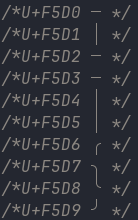
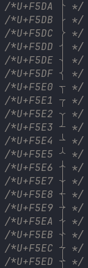
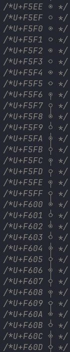

# Git Branch Drawings

Contour implements rendering of git branch characters used by e.g. [vim-flog](https://github.com/rbong/vim-flog) and [gitgraph.nvim](https://github.com/isakbm/gitgraph.nvim).
Initially introduced to [kitty](https://github.com/kovidgoyal/kitty/pull/7681) the symbol set was later expanded to support more commit options.

The symbols use codepoints U+F5D0 ... U+F60D.

!!! note
    U+F5D2 ... U+F5D5 are supposed to be fading out symbols but currently are rendered as simple lines.

<br />
<br />


The symbols may be customized via config options:
```contour.yml
# Controls how git branch drawings are rendered.
# `branch_style` controls style of connecting branches. May be on of `none`,`thin`,`thick`,`double. The default value is `thin`.
# `arc_style` controls style of arcs. May be one of `round`,`ellips`. `arc_style` has effect only if `branch_style` is `thin`. The default value is `round`.
# `merge_commit_style` controls style of merge commits. May be one of `solid`,`bullet`. The default value is `bullet`.

git_drawings:
    branch_style:       thin
    arc_style:          round
    merge_commit_style: bullet
```
