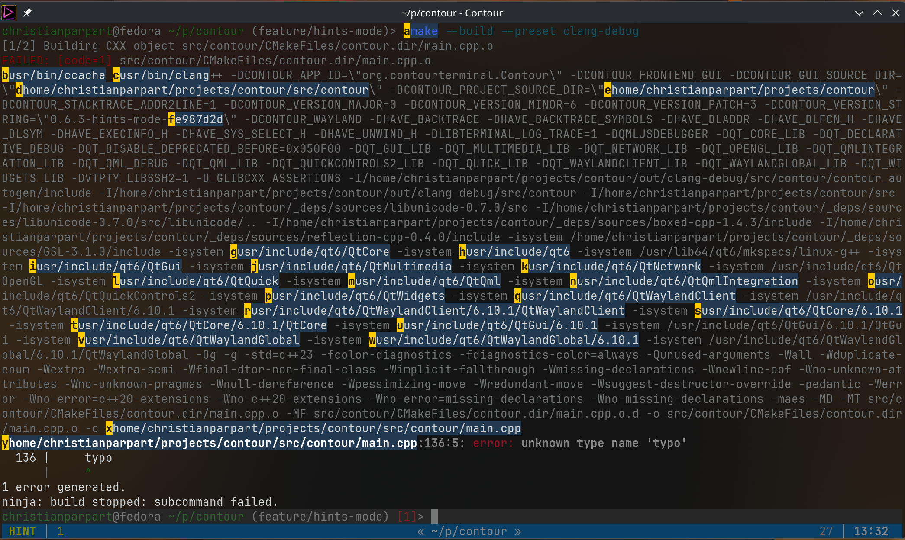

# Hint Mode

Hint mode lets you quickly act on clickable elements visible in the terminal —
URLs, file paths, git commit hashes, IP addresses — using only the keyboard.
When activated, Contour scans the visible screen for recognized patterns,
overlays a short alphabetic label on each match, and waits for you to type a
label to perform an action on that match.

Think of it like [Vimium](https://vimium.github.io/) for your terminal.


## Activating Hint Mode

There are two ways to enter hint mode:

### Via Key Binding (from any mode)

The default key binding activates hint mode for URLs:

```yaml
input_mapping:
    - { mods: [Control, Shift], key: U, action: HintMode, patterns: url, hint_action: Open }
```

Press <kbd>Ctrl</kbd>+<kbd>Shift</kbd>+<kbd>U</kbd> to scan for URLs
and open the selected one in your browser.

### Via Vi Normal Mode

When in [normal mode](../input-modes.md), you can use:

- `gh` — activate hint mode with **Copy** action (yank the match to clipboard)
- `gH` — activate hint mode with **Open** action (open the match, e.g. URL in browser)

These commands scan for all builtin patterns (URLs, file paths, git hashes, IPs).

## Using Hint Mode

Once hint mode is active:

1. **Labels appear** — Each detected match gets a short label (`a`, `b`, ..., `z`; or two-character labels `aa`, `ab`, ... for more than 26 matches).
2. **Type the label** — Type the label characters to select a match. Labels are case-insensitive.
3. **Auto-select** — As soon as your typed characters uniquely identify a match, the action is performed automatically.
4. **Cancel** — Press <kbd>Escape</kbd> to exit hint mode without selecting anything.
5. **Backspace** — Press <kbd>Backspace</kbd> to undo the last typed label character.

## Recognized Patterns

Contour ships with the following builtin pattern detectors:

| Pattern     | Examples                                     | Description                        |
|-------------|----------------------------------------------|------------------------------------|
| `url`       | `https://example.com`, `http://localhost:8080` | HTTP and HTTPS URLs              |
| `filepath`  | `/home/user/file.txt`, `./src/main.cpp`, `lib/utils.h` | Absolute, relative, and home-relative (`~/...`) file paths |
| `githash`   | `a1b2c3d`, `abc1234567890def1234567890abcdef12345678` | 7–40 character hex strings (git commit SHAs) |
| `ipv4`      | `192.168.1.1`, `10.0.0.1:8080`               | IPv4 addresses, optionally with port |
| `ipv6`      | `::1`, `fe80::1`, `2001:0db8:85a3:0000:0000:8a2e:0370:7334` | IPv6 addresses |

### Smart File Path Detection

When the terminal knows the current working directory (via
[shell integration](../vt-extensions/osc-133-shell-integration.md)), Contour
broadens its file path detection to also match:

- **Bare filenames with extensions** — `main.cpp`, `README.md`
- **Extensionless files** — `Makefile`, `LICENSE`, `Dockerfile`, `CHANGELOG`
- **Directory names** — `src`, `build`, `docs`

These bare names are validated against the filesystem: only entries that actually
exist in the current working directory are shown as hints. This means you can
look at `ls` output, compiler errors, or `git status` and jump directly to the
referenced files.



## Actions

The `hint_action` parameter controls what happens when you select a match:

| Action         | Description                                                  |
|----------------|--------------------------------------------------------------|
| `Copy`         | Copy the matched text to the system clipboard (default)      |
| `Open`         | Open the match — URLs open in the browser, files open in the configured editor |
| `Paste`        | Paste the matched text into the terminal input               |
| `CopyAndPaste` | Copy to clipboard **and** paste into the terminal            |
| `Select`       | Copy the matched text to clipboard (visual mode pre-selection is planned) |

## Configuration

### Key Bindings

You can create multiple hint mode bindings for different pattern sets and actions:

```yaml
input_mapping:
    # Open URLs in browser
    - { mods: [Control, Shift], key: U, action: HintMode, patterns: url, hint_action: Open }

    # Copy file paths to clipboard
    - { mods: [Control, Shift], key: F, action: HintMode, patterns: filepath, hint_action: Copy }

    # Copy git hashes to clipboard
    - { mods: [Control, Shift], key: G, action: HintMode, patterns: githash, hint_action: Copy }

    # Scan for all patterns and copy
    - { mods: [Control, Shift], key: H, action: HintMode, patterns: all, hint_action: Copy }
```

The `patterns` parameter accepts:

- A pattern name: `url`, `filepath`, `githash`, `ipv4`, `ipv6`
- `all` or empty: scan for all builtin patterns at once

### Colors

Hint mode label and match colors are configured in the color scheme section of
your configuration:

```yaml
color_schemes:
    default:
        # Colors for the short alphabetic labels overlaid on matches.
        hint_label:
            foreground: '#000000'
            foreground_alpha: 1.0
            background: '#E5C07B'
            background_alpha: 1.0

        # Colors for the matched text behind the labels.
        hint_match:
            foreground: '#ABB2BF'
            foreground_alpha: 1.0
            background: '#3E4452'
            background_alpha: 0.8
```

## Tips and Tricks

- **Shell integration matters** — Ensure your shell reports the current working
  directory via [OSC 133](../vt-extensions/osc-133-shell-integration.md) for the
  best file path detection. Without it, only paths containing a `/` separator are
  matched.

- **Combine with Vi mode** — In normal mode, `gh` (copy) and `gH` (open) are
  quick ways to enter hint mode without reaching for modifier keys.

- **Works with scrollback** — Hint mode scans the currently visible viewport.
  Scroll to the area of interest first, then activate hint mode.

- **Compiler errors** — When viewing build output with file paths like
  `src/main.cpp:42:10: error: ...`, hint mode detects the file path portion,
  making it easy to copy or open the referenced file.

## Related

- [Input Modes](../input-modes.md) — Vi-like input modes including normal mode, where `gh`/`gH` trigger hint mode
- [Key Mapping](../configuration/key-mapping.md) — How to customize key bindings
- [Shell Integration](../vt-extensions/osc-133-shell-integration.md) — Enables smart bare filename detection
