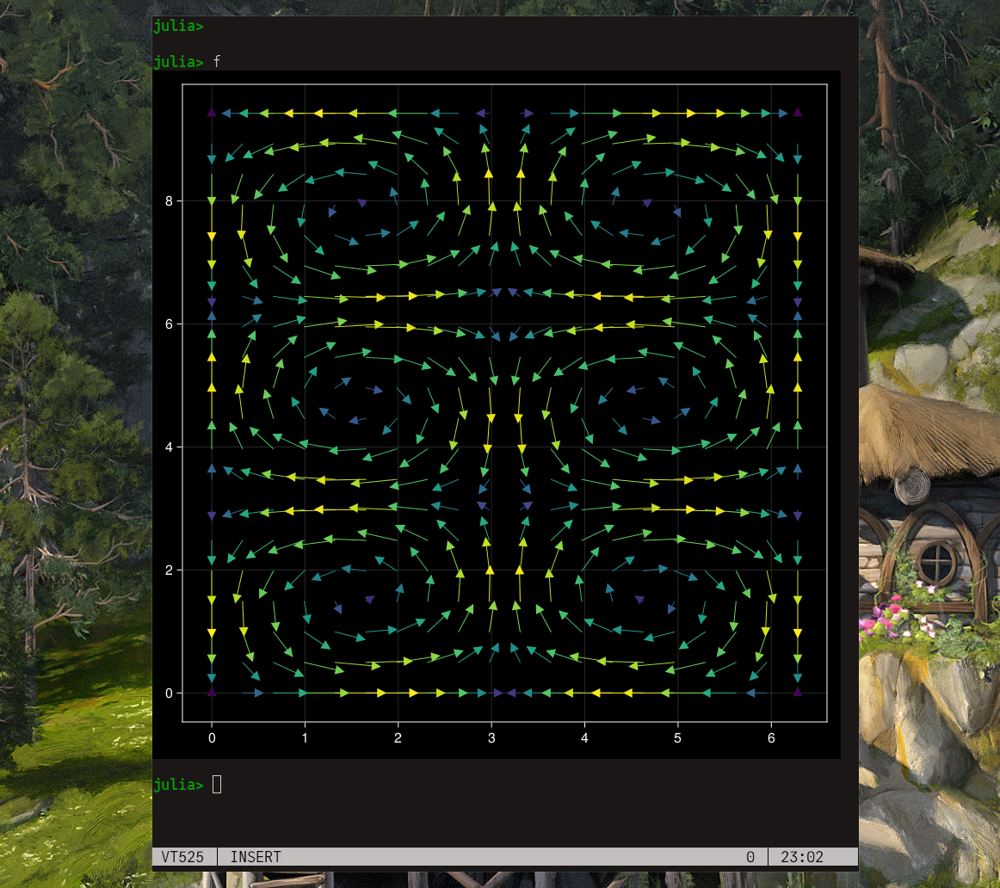

# Contour Terminal Emulator

Contour is a modern and actually fast, modal, virtual terminal emulator,
for everyday use. It is aiming for power users with a modern feature mindset.

**This website is still in DRAFT mode, please be patient while we're building up the content.**

[Install](install.md){ .md-button .md-button--primary }
[Join :simple-discord: ](https://discord.gg/ncv4pG9){ .md-button .md-button--primary }

## Key Features

:material-check-bold:{.check-mark}  Available on all 4 major platforms, Linux, OS/X, FreeBSD, Windows.  
:material-check-bold:{.check-mark}  [Font ligatures](demo/font-ligatures.md) support (very useful for programming and scripting)  
{ align=left }
:material-check-bold:{.check-mark}  Complex Unicode support, including colored Emoji (-: 🌈  💝  😛  👪  - including ZWJ, VS15, VS16 emoji :-)  
:material-check-bold:{.check-mark}  [Vi-like input modes](input-modes.md) for improved navigation, selection and copy'n'paste experience  
:material-check-bold:{.check-mark}  [Vertical Line Markers](demo/line-marks.md) (quickly jump to markers in your history!)  
:material-check-bold:{.check-mark}  Profiles (grouped customization of: color scheme, login shell, and related behaviours)  
:material-check-bold:{.check-mark}  [Sixel Image support](demo/images.md)  
{ align=left}
:material-check-bold:{.check-mark}  [VT320 Host-programmable and Indicator statusline support](demo/statusline.md)  
:material-check-bold:{.check-mark}  Bold and italic fonts  
:material-arrow-right:{.arrow-right-bold} [For a full list of features, click here](features.md)  
