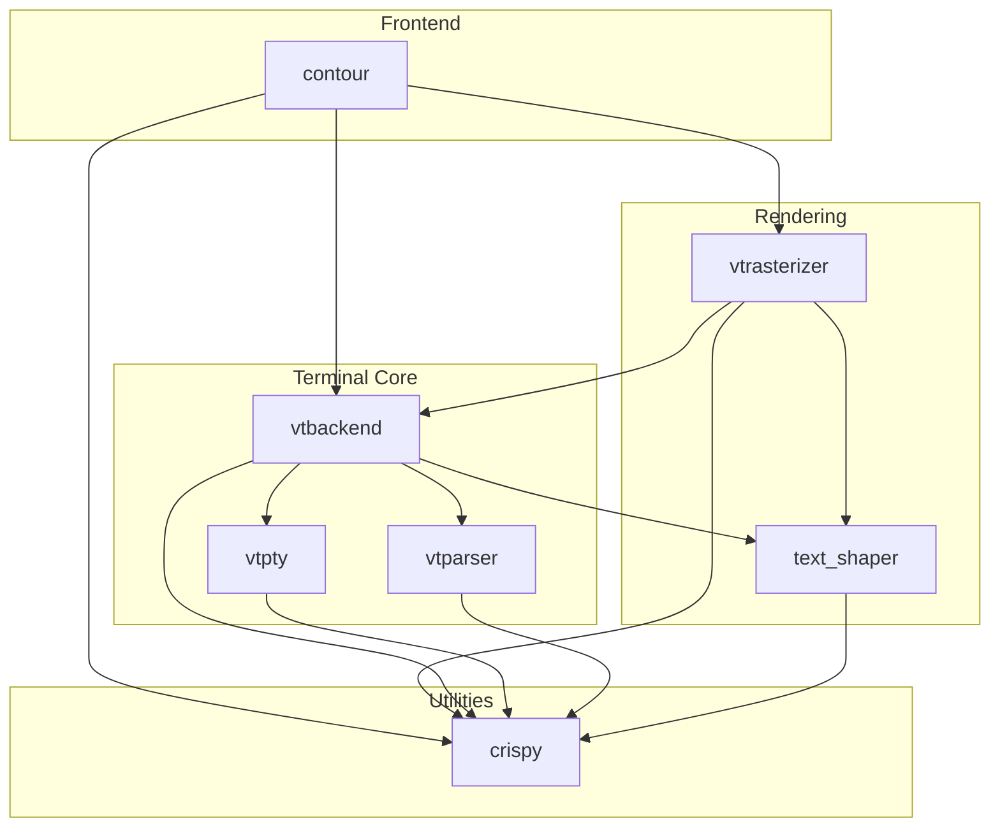
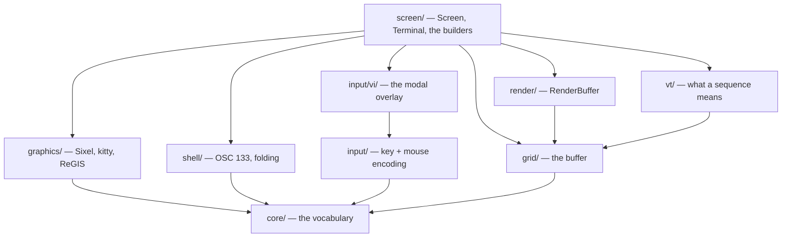
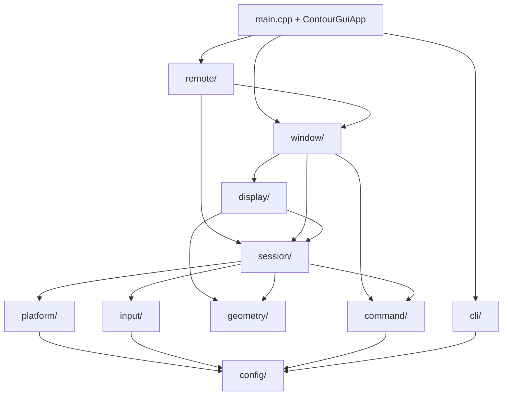

# Software Architecture

This document describes the high-level software architecture of the Contour terminal emulator.

## Overview

Contour is designed as a modular C++ application. The core logic is separated from the GUI frontend, allowing for potential reuse (e.g., in a headless benchmarking tool or alternative frontends).

The project is split into several libraries, located in the `src/` directory.

### Module Dependency Graph



## Modules

### 1. `crispy` (Foundation Library)
**Location:** `src/crispy/`

`crispy` contains general-purpose utility code used throughout the project. It provides the foundational layer upon which other modules are built.

*   **Key Responsibilities:**
    *   Application infrastructure (`App`, `CLI` arguments parsing).
    *   Logging (`logstore`).
    *   Data structures (`Trie`, `LRUCache`, `RingBuffer`).
    *   Utilities (`base64`, `file_descriptor`, `signals`).
*   **Key Dependencies:** `fmt`, `range-v3`, `GSL`.

### 2. `vtparser` (ANSI Parser)
**Location:** `src/vtparser/`

`vtparser` is a state machine implementation for parsing VT100/ANSI escape sequences. It is based on the state machine description by Paul Williams.

*   **Key Responsibilities:**
    *   Parses raw byte streams into structured events (actions).
    *   Does *not* execute the actions; it only identifies them.
*   **Key Dependencies:** `crispy`.

### 3. `vtpty` (Pseudo-Terminal)
**Location:** `src/vtpty/`

`vtpty` abstracts the interaction with the operating system's Pseudo-Terminal (PTY) interface.

*   **Key Responsibilities:**
    *   Spawning child processes (shells).
    *   Reading from and writing to the PTY master side.
    *   Handling window resize events (SIGWINCH).
    *   Managing PTY settings (termios).
    *   Abstracts platform differences (Linux/macOS vs Windows ConPTY).
*   **Key Classes:** `Pty`, `Process`.
*   **Key Dependencies:** `crispy`.

### 4. `text_shaper` (Text Layout & Font Loading)
**Location:** `src/text_shaper/`

`text_shaper` handles the complex task of finding fonts and shaping text (converting characters to glyphs with positions). It provides a uniform API over platform-specific technologies.

*   **Key Responsibilities:**
    *   Font discovery (`FontLocator`).
    *   Text shaping (`Shaper`).
    *   Glyph rasterization (retrieving bitmaps/outlines).
*   **Backends:**
    *   **CoreText** (macOS)
    *   **DirectWrite** (Windows)
    *   **HarfBuzz + FontConfig + FreeType** (Linux/BSD/Cross-platform)
*   **Key Dependencies:** `crispy`, `harfbuzz`, `freetype`, system font libraries.

### 5. `vtbackend` (Terminal Model)
**Location:** `src/vtbackend/`

`vtbackend` contains the core logic of the terminal emulator. It maintains the state of the terminal.

*   **Key Responsibilities:**
    *   **Grid Storage:** Stores the characters and attributes of the screen (`Grid`, `Line`, `Cell`).
    *   **Screen State:** Manages cursor position, modes, and active buffers (`Screen`, `Terminal`).
    *   **Interpreter:** Executes actions triggered by the `vtparser`.
    *   **Input Generation:** Converts keyboard/mouse events into ANSI escape sequences to send to the PTY (`InputGenerator`).
*   **Key Classes:** `Terminal`, `Screen`, `Grid`, `Viewport`.
*   **Key Dependencies:** `crispy`, `vtparser`, `vtpty`.

#### Internal layering

`src/vtbackend/` is layered, one directory per concern. Unlike `src/contour/`, the **namespace
stays flat** — everything is `vtbackend` — so the directories are about finding code, not naming
it, and moving a header changes no consumer's code beyond its `#include` line.



| Directory | Holds |
|---|---|
| `core/` | coordinates, colors, cell and line attributes, hyperlinks, images, file URLs |
| `grid/` | the scrollback ring, its reflow, and a row in trivial and inflated form |
| `vt/` | the sequence table, the payload decoders, and the writers that phrase a reply |
| `graphics/` | the protocols that produce an `Image`; `graphics/regis/` beneath it |
| `input/` | key and mouse events to PTY bytes; `input/vi/` beneath it for vi mode |
| `shell/` | OSC 133 semantic prompts, command blocks, prompt regions, folding |
| `render/` | `RenderBuffer` — what `vtrasterizer` consumes, and nothing else |
| `screen/` | `Screen`, `Terminal`, and everything that walks them |
| `testing/` | `MockTerm` and `TestHelpers`, used by `vtconformance` and `vtrasterizer` tests |

Two rules keep it honest, and both are a `grep` rather than a review question:

*   **`core/` may include nothing but `core/`.** A header also earns its place there only by being
    named from two other directories, or from another module. Together those decide the cases that
    are not obvious: `CellFlags` and `LineFlags` are vocabulary rather than grid storage, `Image`
    is vocabulary rather than a graphics protocol, and `Cursor` is *not* vocabulary because it
    includes `Charset`.

    ```sh
    grep '#include <vtbackend/' src/vtbackend/core/*.hpp | grep -v 'vtbackend/core/'
    grep -rn '#include <vtbackend/screen/' src/vtbackend/render/
    grep -n '#include <vtbackend/input/vi/' src/vtbackend/input/*.hpp
    ```

*   **A builder lives with what it walks, not with what it fills.** `RenderBufferBuilder` calls 15
    members of `Terminal` and 7 of `Screen`; `StatusLineBuilder`'s serializer reads 14 more. Filing
    them under `render/` — beside the `RenderBuffer` they produce — is what made `render/` and
    `screen/` mutually dependent in the first place. `render/` therefore holds the *vocabulary*
    the rasterizer consumes, and the builders sit in `screen/`.

    The alternative was to hand the builders a frame-context struct so they could stay in
    `render/`. It was rejected on cost: severing the edge needs all 22 members abstracted, putting
    nine indirect calls on the per-cell path — and that path runs under `_stateMutex`, which the
    parser thread holds for the full duration of an output burst. Trading VT-thread latency for a
    directory boundary is the wrong way round.

These are **concerns, not enforced layers**: `vtbackend` is a single CMake target, so nothing but
the greps above gates them, and `Terminal.hpp` still includes 25 sibling headers.

### 6. `vtrasterizer` (Rendering)
**Location:** `src/vtrasterizer/`

`vtrasterizer` is responsible for taking the state from `vtbackend` and drawing it to the screen, typically using OpenGL.

*   **Key Responsibilities:**
    *   Manages the texture atlas for glyphs (`TextureAtlas`).
    *   Renders the grid background, text, cursor, and decorations.
*   **Key Classes:** `Renderer`, `TextRenderer`, `GridRenderer`.
*   **Key Dependencies:** `vtbackend`, `text_shaper`, `crispy`.

### 7. `contour` (Application & Frontend)
**Location:** `src/contour/`

`contour` is the executable module. It ties everything together using the Qt framework (specifically QtQuick/QML).

*   **Key Responsibilities:**
    *   Window management and OS integration.
    *   Configuration loading (`Config`).
    *   Input event handling (Qt events -> `vtbackend`).
    *   Display loop (Painting `vtrasterizer` output to a `QQuickItem`).
    *   Audio playback.
*   **Key Classes:** `ContourApp`, `TerminalSession`, `WindowController`.
*   **Key Dependencies:** `vtbackend`, `vtrasterizer`, `vtworkspace`, `crispy`, `Qt6`.

#### Internal layering

`src/contour/` is itself layered, one directory per concern, and every directory names the
namespace it holds — `config/` is `contour::config`, `session/` is `contour::session`, and so on.
Only `main.cpp` and `ContourGuiApp`, the composition root, sit at the top level.



The bottom three layers — `config/`, `command/` and `cli/` — are **Qt-free**, and the build says
so rather than leaving it to review: `contour_config`, `contour_command` and `contour_cli` are
library targets that link no Qt at all. A `QObject` in the configuration model is therefore a build
error. It is also what a `CONTOUR_FRONTEND_GUI=OFF` build consists of: `contour_cli` plus the two
layers beneath it, and nothing that renders.

| Directory | Namespace | Holds |
|---|---|---|
| `config/` | `contour::config` (+ `contour::actions`) | the configuration model, its parsing and persistence |
| `command/` | `contour::command` | the command palette's vocabulary and the context menus built from it |
| `cli/` | `contour::cli` | the headless application: every verb that opens no window |
| `geometry/` | `contour::geometry` | page ⇄ pixel geometry, spoken by session, display and window alike |
| `input/` | `contour::input` | Qt event → `vtbackend` input translation, with no knowledge of sessions |
| `platform/` | `contour::platform` | adapters to Qt and the OS: bell, blur, notifications, speech, URLs |
| `session/` | `contour::session` | one terminal session, the session-lifetime service, input routing |
| `display/` | `contour::display` | the `QQuickItem` terminal, the RHI renderer, accessibility |
| `window/` | `contour::window` | the per-OS-window Qt/QML adapters |
| `remote/` | `contour::remote` | the daemon and tmux attach engines |

Two rules keep this honest:

*   **The consumer declares the interface, the provider depends on the consumer.** Where a lower
    layer has to call back into a higher one, the seam is an interface owned by the lower layer.
    The two that carry the graph above are:

    | Interface | Declared in | Implemented by | What it is |
    |---|---|---|---|
    | `session::DisplaySurface` | `session/` | `display::TerminalDisplay` | the view a session drives — redraw, fonts, cursor shape, resize requests |
    | `display::WindowHost` | `display/` | `window::WindowController` | the OS window a display is shown in — full-screen, WM size hints, title bar, tab strip |

    Without them the arrows between `session/`, `display/` and `window/` point both ways. With
    them the concrete types are named only downwards, and `session/` compiles without knowing that
    a `QQuickItem` exists — which is what makes `TerminalSession` constructible against a recording
    stub (`test::FakeDisplaySurface`) instead of a scene graph and an RHI device.

    The window layer speaks `DisplaySurface` too: a window sizes itself from the pane it shows, so
    `WindowHost` takes one as its "requester" rather than a display class. A handful of surface
    methods therefore exist for the window rather than the session, and are marked as such.
*   **Where a decision can be separated from the machinery that acts on it, it is.**
    `NotificationRouter` vs `FreeDesktopNotifier`, `AudioNote` vs `Audio`, `ContextMenu` vs
    `ContextMenuModel`, `speakableText` vs `QtSpeechSynthesizer` — in each pair the first half is
    Qt-free and unit-tested, and the second is the adapter that cannot be.

---

## Data Flow Examples

### Life of a Key Press

1.  **User** parses a key (e.g., 'A') on the keyboard.
2.  **Qt** receives the OS event and passes it to `contour::TerminalQuickItem`.
3.  **Contour** forwards the event to `vtbackend::Terminal::sendKeyEvent`.
4.  **VTBackend**'s `InputGenerator` converts the key info into bytes (e.g., `A` or `\033[A`).
5.  **VTBackend** writes these bytes to the `vtpty::Pty`.
6.  **VTPty** writes the bytes to the master file descriptor of the PTY.
7.  **OS** passes the data to the shell process (e.g., `zsh`) running in the PTY.

### Life of a Character (Output)

1.  **Shell** (e.g., `zsh`) writes bytes to stdout/stderr.
2.  **OS** makes these bytes available on the PTY master file descriptor.
3.  **VTPty** reads the bytes in a background thread or via `select`/`poll`.
4.  **VTBackend** receives the bytes via `Terminal::writeToScreen`.
5.  **VTBackend** feeds the bytes into the `vtparser`.
6.  **VTParser** decodes the sequence (e.g., plain char 'A', or color code `\033[31m`) and invokes a callback on `vtbackend::Screen`.
7.  **Screen** updates the `Grid` (writing the character 'A' into a cell, or changing the current color attribute).
8.  **Contour** (GUI thread) requests a frame update.
9.  **VTRasterizer** locks the `Terminal`/`Grid` for reading.
10. **VTRasterizer** iterates over the `Grid` cells visible in the `Viewport`.
11. **VTRasterizer** asks `text_shaper` to rasterize glyphs if not already in the `TextureAtlas`.
12. **VTRasterizer** submits GPU draw calls to draw the background quads and glyph textures.
13. **GPU** presents the frame to the user.
